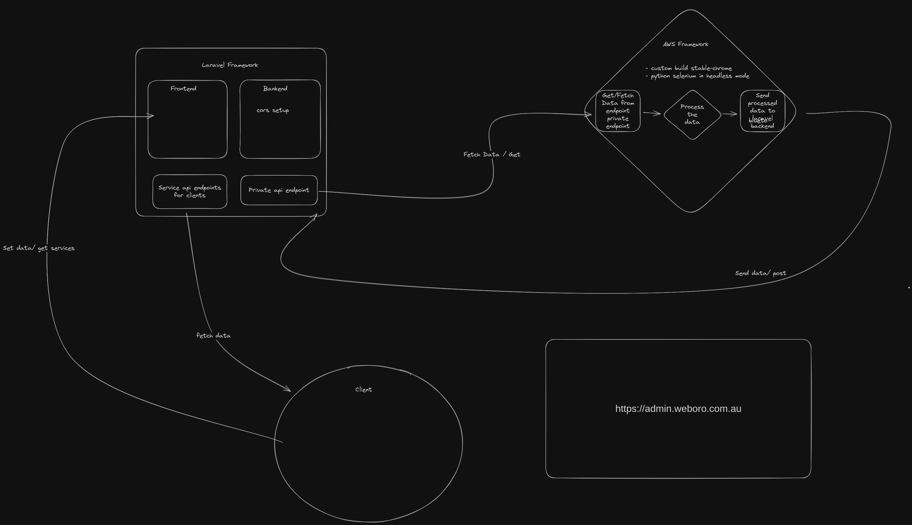

# working's diagram

# weboro_widget
weboro widget that acts as middleware between Application's Api layer and Weboro admin site.

# How to run on Docker 
- Step 1: docker build -t selenium-cron-image .

- Step 2: docker run -d --name selenium-cron selenium-cron-image

## Note:
This application runs once everyday at midnight so any change you make will take place after midnight. 

## If you immediatly want to reflect the changes and update you can use this command line 
- docker exec selenium-cron sh -c "python /app/main.py > /app/realtime_run.log"

